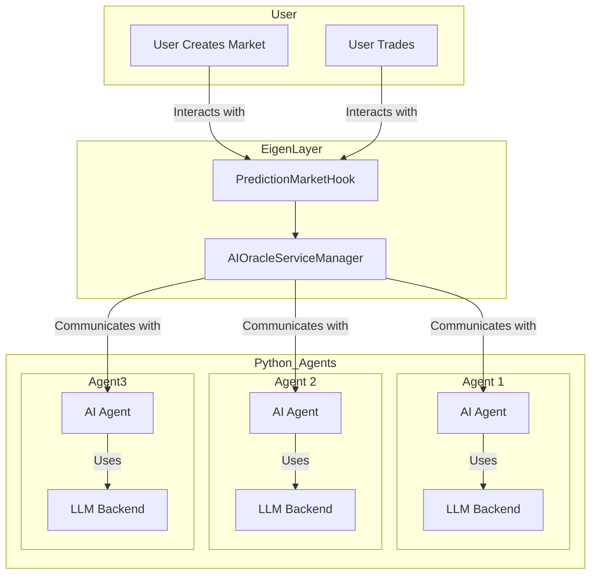
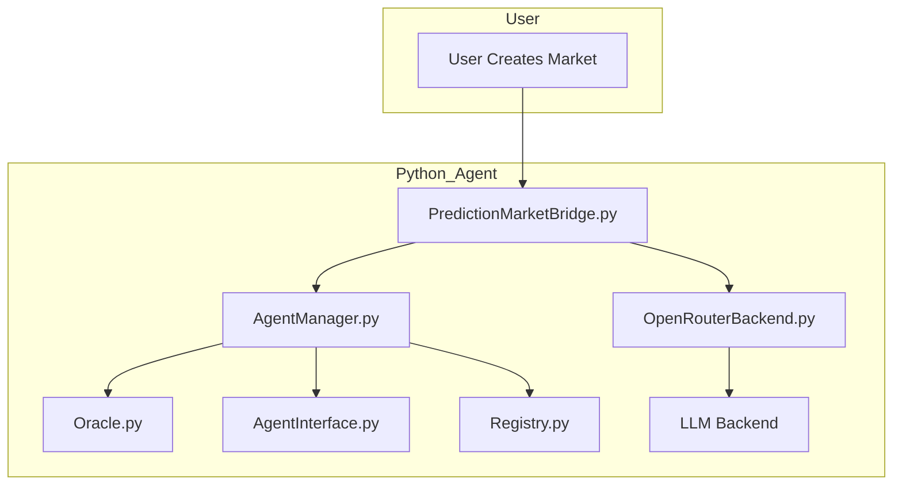

# EigenLayer AI Agent

An AI agent system integrated with EigenLayer for prediction markets and oracle services.

## High-Level Schema




## Installation

### Using Poetry

```bash
git clone https://github.com/vistalabs-org/eigenlayer-ai-agent.git
cd eigenlayer-ai-agent
poetry install
```

## Configuration

Create a configuration file `config.json` with the following structure:

```json
{
  "rpc_url": "http://localhost:8545",
  "oracle_address": "0x...",
  "registry_address": "0x...",
  "agent_address": "0x...",
  "model": "openai/gpt-4-turbo",
  "api_key": "your-openrouter-api-key",
  "private_key": "your-private-key"
}
```


## Usage

### Run the AI Agent

```bash
poetry run agent --config config.json
```

### Command Line Options

```
--config CONFIG       Path to configuration file
--interval INTERVAL   Polling interval in seconds
--run-once            Run the script once and exit
--oracle-address ORACLE_ADDRESS
                      Override Oracle address from config
--market-address MARKET_ADDRESS
                      Address of PredictionMarketHook contract
```

## Development

### Testing

```bash
poetry run pytest
```

### Format Code

```bash
poetry run black .
poetry run isort .
```


## Detailed Schema


